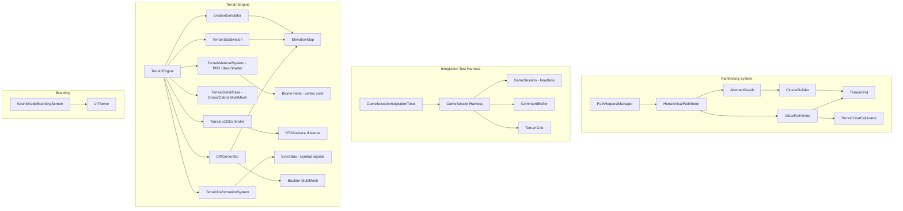
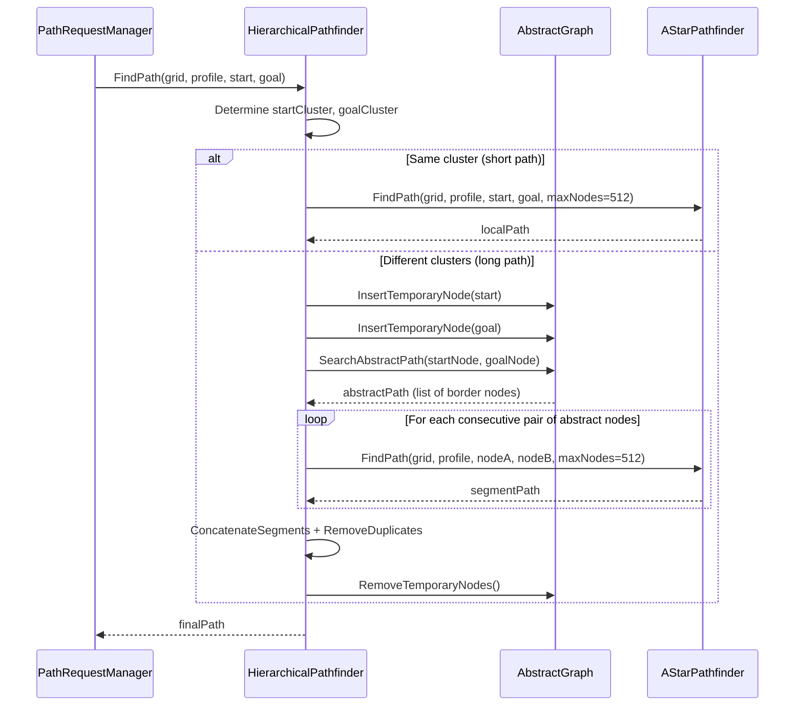
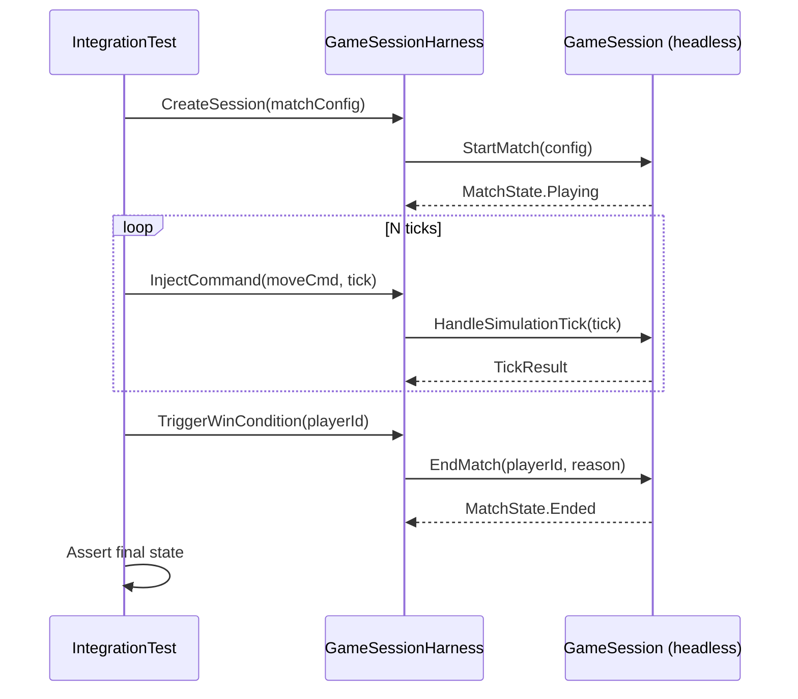

# Design Document: Hierarchical Pathfinding and Polish

## Overview

This feature bundle adds four improvements to Cordite Wars: Six Fronts:

1. **Hierarchical Pathfinding (HPA\*)** — A two-level hierarchical A\* implementation that accelerates long-distance pathfinding on maps up to 512×512. The grid is partitioned into clusters (16×16 cells each), with pre-computed inter-cluster edges forming an abstract graph. Long paths are resolved on the abstract graph first, then refined within each cluster using the existing `AStarPathfinder`. This reduces the search space from ~262k cells to ~1k abstract nodes for cross-map paths while preserving determinism and FixedPoint math.

2. **AAA Procedural Terrain Engine** — Complete overhaul of the terrain rendering system. The current mesh has one vertex per grid cell, causing visible polygon faceting. The new engine features: configurable 2×–8× mesh subdivision with Catmull-Rom bicubic interpolation, hydraulic and thermal erosion simulation for natural-looking terrain, a 5-layer PBR uber-shader with slope/height/moisture-based material blending, triplanar projection on cliffs, vertex ambient occlusion baking, instanced detail grass/debris via MultiMesh, combat terrain deformation (craters, scorch marks, vehicle tracks that fade over time), procedural cliff faces with layered rock strata and boulder scatter, and per-quality-tier LOD. All procedural (no external textures), compatible with `gl_compatibility` renderer, and scales from Potato (identical to current) through High (AAA quality).

3. **GameSession Integration Tests** — End-to-end xunit v3 tests that exercise the full match lifecycle: session creation, tick processing (command dispatch, pathfinding, combat resolution, win condition evaluation), and match termination. These tests validate that the simulation pipeline produces deterministic results without requiring Godot runtime.

4. **Branding Placeholder Fix** — Replace the `"BRANDING PLACEHOLDER"` subtitle in `KoshkiKodeBrandingScreen.cs` with the KoshkiKode company tagline: `"Precision-Crafted Warfare"`.

## Architecture



## Sequence Diagrams

### HPA* Path Resolution



### GameSession Integration Test Lifecycle



## Components and Interfaces

### Component 1: ClusterGrid

**Purpose**: Partitions the TerrainGrid into fixed-size clusters and identifies border cells (entrances) between adjacent clusters.

**Interface**:
```csharp
namespace CorditeWars.Systems.Pathfinding;

public sealed class ClusterGrid
{
    public int ClusterSize { get; }          // 16 cells per side
    public int ClustersX { get; }            // Width / ClusterSize (rounded up)
    public int ClustersY { get; }            // Height / ClusterSize (rounded up)

    public ClusterGrid(int gridWidth, int gridHeight, int clusterSize = 16);

    /// Returns the cluster index (cx, cy) for a given grid cell.
    public (int cx, int cy) GetClusterForCell(int x, int y);

    /// Returns all entrance nodes between two adjacent clusters.
    public ReadOnlySpan<EntranceNode> GetEntrances(int clusterAx, int clusterAy,
                                                    int clusterBx, int clusterBy);
}
```

**Responsibilities**:
- Divide the map into 16×16 clusters (32×32 clusters on a 512×512 map)
- Identify contiguous runs of traversable border cells between adjacent clusters
- Collapse each run into 1–2 entrance nodes (endpoints of the run)
- Rebuild entrances when terrain changes (dynamic obstacle placement)

### Component 2: AbstractGraph

**Purpose**: Stores the high-level graph of entrance nodes and intra-cluster edges, enabling fast cross-map pathfinding.

**Interface**:
```csharp
public sealed class AbstractGraph
{
    /// Total number of permanent nodes in the graph.
    public int NodeCount { get; }

    /// Builds the abstract graph from a ClusterGrid and TerrainGrid.
    public void Build(ClusterGrid clusters, TerrainGrid grid, MovementProfile profile);

    /// Inserts a temporary start/goal node, connecting it to all entrances
    /// in its cluster via intra-cluster A* distances.
    public int InsertTemporaryNode(int x, int y, TerrainGrid grid, MovementProfile profile);

    /// Removes all temporary nodes added since the last Build().
    public void RemoveTemporaryNodes();

    /// A* search on the abstract graph. Returns ordered list of node indices.
    public List<int> Search(int startNodeIdx, int goalNodeIdx);

    /// Gets the grid position of a node by index.
    public (int x, int y) GetNodePosition(int nodeIdx);
}
```

**Responsibilities**:
- Store nodes (entrance positions) and weighted edges (intra-cluster distances)
- Support temporary node insertion for start/goal positions
- Provide A\* search on the abstract graph using FixedPoint costs
- Use SortedList for edge storage (determinism requirement)

### Component 3: HierarchicalPathfinder

**Purpose**: Orchestrates the two-level pathfinding: abstract search followed by local refinement.

**Interface**:
```csharp
public sealed class HierarchicalPathfinder
{
    public HierarchicalPathfinder(int clusterSize = 16);

    /// Precomputes the abstract graph for the given grid and profile.
    /// Must be called once per map load and whenever terrain changes.
    public void Preprocess(TerrainGrid grid, MovementProfile profile);

    /// Finds a path using hierarchical decomposition.
    /// Falls back to direct A* for same-cluster paths.
    public List<(int x, int y)> FindPath(
        TerrainGrid grid, MovementProfile profile,
        int startX, int startY, int goalX, int goalY,
        int maxNodes = 8192);

    /// Invalidates clusters affected by a terrain change at (x, y).
    public void InvalidateCell(int x, int y);

    /// Rebuilds invalidated clusters (call after batch terrain changes).
    public void RebuildInvalidated(TerrainGrid grid, MovementProfile profile);
}
```

**Responsibilities**:
- Decide whether to use hierarchical or direct A\* based on distance
- Insert temporary nodes for start/goal, search abstract graph, refine segments
- Concatenate refined segments into a single contiguous path
- Support incremental updates when terrain changes (building placement)

### Component 4: AAA Procedural Terrain Engine

**Purpose**: Replaces the current 1-vertex-per-cell terrain with a high-fidelity procedural rendering system featuring dense mesh subdivision, multi-layer PBR material blending, displacement-quality elevation, and per-biome micro-detail — all without external texture files, compatible with Godot's `gl_compatibility` renderer.

**Architecture Overview**:
```
TerrainEngine (orchestrator)
├── TerrainSubdivision        — Catmull-Rom bicubic mesh densification
├── TerrainMaterialSystem     — Multi-layer procedural PBR shader
├── ErosionSimulator          — Hydraulic + thermal erosion on elevation map
├── TerrainDetailPass         — Grass/debris instancing via MultiMesh
└── TerrainLODController      — Distance-based subdivision scaling
```

**Interface**:
```csharp
namespace CorditeWars.Game.World;

/// <summary>
/// AAA-grade procedural terrain engine. Generates dense, smooth terrain meshes
/// with multi-layer material blending, simulated erosion, and detail instancing.
/// Compatible with gl_compatibility renderer (no tessellation/compute required).
/// </summary>
public sealed class TerrainEngine
{
    /// <summary>Subdivision factor per grid cell (vertices per cell edge).</summary>
    public int SubdivisionFactor { get; }

    /// <summary>Whether erosion simulation was applied.</summary>
    public bool ErosionApplied { get; }

    public TerrainEngine(QualityTier tier);

    /// <summary>
    /// Generates the complete terrain from map data.
    /// Performs: elevation build → erosion → subdivision → mesh gen → detail pass.
    /// </summary>
    public void Generate(MapData mapData, Node3D parent);

    /// <summary>
    /// Returns interpolated elevation at world position using the same
    /// Catmull-Rom spline as the mesh, ensuring units sit on the surface.
    /// </summary>
    public float GetElevationAtWorld(float worldX, float worldZ);

    /// <summary>Rebuilds a single chunk (for dynamic terrain changes).</summary>
    public void RebuildChunk(int chunkX, int chunkY);
}
```

**Quality Tier Mapping**:

| Setting | Potato | Low | Medium | High |
|---------|--------|-----|--------|------|
| Subdivision factor | 1× | 2× | 4× | 8× |
| Erosion passes | 0 | 0 | 3 | 8 |
| Shader layers | 2 | 3 | 5 | 5 |
| Detail grass | Off | Off | Sparse | Dense |
| Normal quality | Flat | Central diff | Sobel 3×3 | Sobel 5×5 |
| Triplanar blending | Off | Off | On | On |
| Parallax depth | Off | Off | Off | On |
| AO baking | Off | Off | Vertex AO | Vertex AO |
| Macro variation | Off | Off | On | On |

**Sub-Component: ErosionSimulator**

Simulates hydraulic and thermal erosion on the elevation map before mesh generation. This creates natural-looking terrain with gullies, sediment deposits, and weathered ridgelines — the single biggest visual upgrade over flat elevation zones.

```csharp
public sealed class ErosionSimulator
{
    /// <summary>
    /// Applies iterative hydraulic erosion to the elevation map.
    /// Each droplet traces a path downhill, eroding material and depositing
    /// sediment based on carrying capacity and velocity.
    /// </summary>
    /// <param name="elevation">Mutable elevation array (width × height).</param>
    /// <param name="width">Grid width.</param>
    /// <param name="height">Grid height.</param>
    /// <param name="iterations">Number of water droplets to simulate (more = smoother).</param>
    /// <param name="seed">Deterministic seed for droplet placement.</param>
    public void HydraulicErosion(float[] elevation, int width, int height,
                                  int iterations = 50000, uint seed = 42);

    /// <summary>
    /// Applies thermal erosion: material slides from steep slopes to adjacent
    /// lower cells until the talus angle threshold is satisfied.
    /// </summary>
    public void ThermalErosion(float[] elevation, int width, int height,
                                int passes = 5, float talusAngle = 0.6f);
}
```

**Sub-Component: TerrainMaterialSystem (Shader)**

A single uber-shader that procedurally blends 5 material layers based on elevation, slope, moisture, and noise. Each layer has its own albedo generation, normal perturbation, roughness, and micro-detail.

```glsl
// Terrain PBR Uber-Shader (gl_compatibility compatible)
shader_type spatial;
render_mode cull_back, diffuse_burley, specular_schlick_ggx;

// ─── Material Layers ──────────────────────────────────────────────
// Layer 0: Bedrock (high elevation, steep slopes)
// Layer 1: Rocky soil (mid-high elevation, moderate slopes)
// Layer 2: Grass/vegetation (low-mid elevation, flat)
// Layer 3: Sand/dirt (low elevation, dry areas, paths)
// Layer 4: River sediment / mud (near water, low elevation)

// Each layer generates:
//   - Albedo (procedural color with FBM variation)
//   - Normal perturbation (procedural bump)
//   - Roughness (varies with wetness/exposure)
//   - AO contribution

// ─── Blending Logic ───────────────────────────────────────────────
// Slope-based: steep → rock, flat → grass
// Height-based: high → bedrock, low → sand
// Moisture-based: wet → mud/sediment, dry → sand
// Noise-based: organic transitions (no hard lines between biomes)
// Triplanar projection on steep surfaces to prevent stretching
```

**Sub-Component: TerrainDetailPass**

Instanced grass blades, small rocks, and debris scattered across the terrain using MultiMeshInstance3D. Density controlled by quality tier and biome type.

```csharp
public sealed class TerrainDetailPass
{
    /// <summary>
    /// Scatters detail instances (grass, pebbles, debris) across the terrain.
    /// Uses Poisson disk sampling for natural distribution.
    /// </summary>
    public void Generate(MapData mapData, float[] elevation, int width, int height,
                          QualityTier tier, Node3D parent);
}
```

**Key Design Decisions**:
- **No external textures** — all surface detail is generated analytically in the shader. This keeps the download size small and avoids texture tiling artifacts entirely.
- **Erosion before subdivision** — erosion operates on the base grid (fast), then subdivision smooths the eroded result (looks natural).
- **Biome-aware layer weights** — the shader receives per-vertex biome hints via vertex color channels, allowing desert maps to emphasize sand/rock layers while temperate maps emphasize grass/soil.
- **Triplanar only on steep surfaces** — flat areas use standard UV projection (cheaper). Steep cliffs (slope > 45°) switch to triplanar to avoid stretching. Blended smoothly at the transition.
- **Vertex AO** — baked at mesh generation time by sampling neighboring elevation. Cheap (no runtime cost) and adds significant depth to valleys and crevices.
- **8× subdivision on High** — on a 128×128 map this gives ~1M triangles per chunk (60 cells × 8 = 480 vertices per axis per chunk). Modern GPUs handle this trivially. On 512×512 maps, LOD kicks in for distant chunks.

### Component 5: Terrain Combat Deformation

**Purpose**: Explosions, superweapons, and fire weapons leave persistent visual marks on the terrain — craters, scorched earth, and vehicle tracks — that fade over time. Purely visual (does not affect simulation grid or pathfinding).

**Interface**:
```csharp
namespace CorditeWars.Game.World;

/// <summary>
/// Manages runtime terrain deformation from combat events.
/// Listens to EventBus combat signals and applies visual modifications
/// to the terrain mesh and shader parameters.
/// </summary>
public sealed class TerrainDeformationSystem : Node
{
    /// <summary>Maximum concurrent deformation marks before oldest are recycled.</summary>
    public const int MaxDeformations = 256;

    /// <summary>Time in seconds before a deformation fully fades.</summary>
    public const float FadeDuration = 120f; // 2 minutes

    /// <summary>Initializes and wires to EventBus combat signals.</summary>
    public void Initialize(TerrainEngine terrainEngine);

    /// <summary>
    /// Creates a crater at the given world position.
    /// Deforms mesh vertices downward in a radius, darkens albedo,
    /// and spawns debris particles.
    /// </summary>
    public void CreateCrater(Vector3 worldPosition, float radius, float depth);

    /// <summary>
    /// Scorches terrain in a radius (fire weapons, napalm).
    /// Darkens and desaturates albedo, increases roughness.
    /// </summary>
    public void ScorchTerrain(Vector3 worldPosition, float radius);

    /// <summary>
    /// Adds a vehicle track segment between two world positions.
    /// Slightly depresses terrain and adds dirt-colored trail.
    /// </summary>
    public void AddVehicleTrack(Vector3 from, Vector3 to, float width);

    /// <summary>Called each frame to fade old deformations.</summary>
    public override void _Process(double delta);
}
```

**Implementation Strategy**:
- **Crater geometry**: Modify vertex positions in affected chunks by displacing Y downward using a smooth falloff function (cosine bell). Regenerate only the affected chunk mesh (not the whole map).
- **Scorch marks**: Inject per-deformation data into the shader via a deformation texture (RGBA: XZ position, radius, intensity). The shader samples this and darkens/desaturates the albedo in the affected area.
- **Vehicle tracks**: Stored as line segments in a ring buffer. Shader draws them as darkened strips with slight displacement.
- **Fading**: Each deformation has a birth time. The shader multiplies intensity by `1.0 - (age / FadeDuration)`. When fully faded, the slot is recycled.
- **Ring buffer**: Fixed 256-slot array. When full, oldest deformation is overwritten. No heap allocations at runtime.
- **Event wiring**: Listens to `EventBus.AttackImpact` (for craters), `EventBus.SuperweaponFired` (large craters), and `EventBus.UnitDeath` (small scorch at death position).

**Deformation Data (passed to shader)**:
```csharp
public struct TerrainDeformation
{
    public Vector2 Position;    // World XZ
    public float Radius;        // Effect radius
    public float Depth;         // Vertex displacement (craters only)
    public float Intensity;     // 1.0 = fresh, fades to 0.0
    public int Type;            // 0 = crater, 1 = scorch, 2 = track
    public float BirthTime;     // Time.GetTicksMsec() when created
}
```

### Component 6: Procedural Cliff Faces & Rock Formations

**Purpose**: Generates vertical cliff geometry with overhangs, layered sedimentary rock strata visible in cross-sections, and scattered boulders at cliff bases. Activates automatically where elevation gradients exceed a threshold.

**Interface**:
```csharp
namespace CorditeWars.Game.World;

/// <summary>
/// Generates procedural cliff face geometry and boulder scatter
/// at locations where terrain slope exceeds the cliff threshold.
/// </summary>
public sealed class CliffGenerator
{
    /// <summary>Minimum slope (in degrees) to trigger cliff face generation.</summary>
    public const float CliffSlopeThreshold = 55f;

    /// <summary>
    /// Analyzes the elevation map and generates cliff meshes where slopes
    /// are steep enough. Adds layered rock strata, overhangs, and
    /// scattered boulders at the base.
    /// </summary>
    /// <param name="elevation">Base elevation map.</param>
    /// <param name="width">Grid width.</param>
    /// <param name="height">Grid height.</param>
    /// <param name="biome">Map biome (affects rock color and strata pattern).</param>
    /// <param name="tier">Quality tier (affects geometry detail).</param>
    /// <param name="parent">Scene node to attach cliff meshes to.</param>
    public void Generate(float[] elevation, int width, int height,
                          string biome, QualityTier tier, Node3D parent);
}
```

**Generation Algorithm**:
1. **Cliff Detection**: Scan elevation map for cells where the slope between adjacent cells exceeds `CliffSlopeThreshold` (55°). Mark these as cliff edges.
2. **Cliff Face Mesh**: For each cliff edge, generate a vertical quad strip from the lower elevation to the upper elevation. Add horizontal ledge geometry at regular intervals (strata layers).
3. **Overhang Generation**: At random intervals along cliff faces (seeded by position for determinism), extrude the upper portion outward by 0.3–0.8 units to create overhangs.
4. **Rock Strata Shader**: The cliff face mesh uses a dedicated shader that generates horizontal banding (sedimentary layers) with per-layer color variation, cracks, and weathering.
5. **Boulder Scatter**: At the base of each cliff face, spawn 2–5 boulder meshes (procedural icosphere with noise displacement) using MultiMeshInstance3D. Boulders are colored to match the cliff rock.
6. **Biome Adaptation**:
   - Temperate: grey-brown limestone with moss on north-facing surfaces
   - Desert: red/orange sandstone with wind-carved erosion patterns
   - Rocky/Mountain: dark granite with quartz veins
   - Coastal: chalk-white cliffs with flint bands
   - Tropical: dark basalt with vine overgrowth hints

**Quality Tier Scaling**:

| Setting | Potato | Low | Medium | High |
|---------|--------|-----|--------|------|
| Cliff face subdivisions | 2 | 4 | 8 | 16 |
| Strata layers visible | 0 | 2 | 5 | 8 |
| Overhang geometry | Off | Off | Simple | Detailed |
| Boulder count per cliff | 0 | 1 | 3 | 5 |
| Boulder mesh detail | N/A | Low-poly | Medium | High |
| Cliff face shader | Flat color | 2-layer | Full strata | Full + cracks |

**Cliff Face Shader** (dedicated, separate from terrain uber-shader):
```glsl
shader_type spatial;
render_mode cull_back, diffuse_burley, specular_schlick_ggx;

// Generates horizontal rock strata with:
// - Per-layer color variation (warm/cool alternating bands)
// - Procedural cracks along layer boundaries
// - Weathering darkening at exposed edges
// - Moss/lichen on sheltered overhangs (north-facing, low slope)
// - Roughness variation (smooth worn surfaces vs rough fractures)
```

### Component 7: GameSessionHarness (Test Infrastructure)

**Purpose**: Provides a headless, Godot-free wrapper around the simulation systems for integration testing.

**Interface**:
```csharp
namespace CorditeWars.Tests.Integration;

public sealed class GameSessionHarness : IDisposable
{
    public TerrainGrid Grid { get; }
    public PathRequestManager PathRequests { get; }
    public UnitInteractionSystem UnitInteraction { get; }
    public MatchState CurrentState { get; }
    public ulong CurrentTick { get; }

    public GameSessionHarness(MatchConfig config);

    /// Advances the simulation by one tick, processing all queued commands.
    public TickResult ProcessTick();

    /// Advances the simulation by N ticks.
    public void AdvanceTicks(int count);

    /// Injects a command to be processed on the specified tick.
    public void InjectCommand(ICommand command, ulong targetTick);

    /// Spawns a unit at the given position, returns its ID.
    public int SpawnUnit(string unitTypeId, int playerId, int x, int y);

    /// Triggers match end.
    public void EndMatch(int winnerId, string reason);

    public void Dispose();
}
```

**Responsibilities**:
- Initialize simulation systems without Godot scene tree
- Provide deterministic tick advancement
- Allow command injection for test scenarios
- Expose simulation state for assertions

## Data Models

### EntranceNode

```csharp
/// Represents a border crossing point between two adjacent clusters.
public struct EntranceNode
{
    /// Grid X coordinate of this entrance.
    public int X;

    /// Grid Y coordinate of this entrance.
    public int Y;

    /// Index of the cluster on side A (clusterAy * ClustersX + clusterAx).
    public int ClusterA;

    /// Index of the cluster on side B.
    public int ClusterB;

    /// Unique node index in the AbstractGraph.
    public int NodeIndex;
}
```

**Validation Rules**:
- X and Y must be within grid bounds
- ClusterA and ClusterB must be adjacent (Manhattan distance of cluster indices == 1)
- NodeIndex must be non-negative and unique

### AbstractEdge

```csharp
/// Weighted edge in the abstract graph.
public struct AbstractEdge
{
    /// Target node index.
    public int TargetNode;

    /// FixedPoint cost (intra-cluster A* distance or inter-cluster crossing cost).
    public FixedPoint Cost;

    /// Whether this is an inter-cluster edge (crossing) or intra-cluster edge.
    public bool IsInterCluster;
}
```

**Validation Rules**:
- Cost must be positive (> FixedPoint.Zero)
- TargetNode must reference a valid node index
- Inter-cluster edges connect nodes in different clusters; intra-cluster edges connect nodes within the same cluster

### MatchConfig (existing, relevant fields)

```csharp
public sealed class MatchConfig
{
    public string MapId { get; set; }
    public int MatchSeed { get; set; }
    public PlayerConfig[] PlayerConfigs { get; set; }
    public WinCondition WinCondition { get; set; }
    public MapGenerationConfig? MapGeneration { get; set; }
    // ... other fields
}
```

## Algorithmic Pseudocode

### HPA* Preprocessing Algorithm

```csharp
/// Builds the abstract graph for a given terrain grid and movement profile.
/// Called once at map load and incrementally on terrain changes.
///
/// Preconditions:
///   - grid is non-null with Width >= 2 and Height >= 2
///   - profile is a valid MovementProfile
///   - clusterSize divides evenly into reasonable chunks (default 16)
///
/// Postconditions:
///   - AbstractGraph contains all entrance nodes and intra/inter-cluster edges
///   - All edge costs are computed using FixedPoint arithmetic
///   - Graph is ready for Search() calls
///
/// Complexity: O(C * E * S) where C = number of clusters,
///   E = entrances per cluster border, S = A* search within cluster
public void Preprocess(TerrainGrid grid, MovementProfile profile)
{
    // Step 1: Partition grid into clusters
    _clusterGrid = new ClusterGrid(grid.Width, grid.Height, _clusterSize);

    // Step 2: Identify entrances along all cluster borders
    //   For each pair of adjacent clusters (horizontal and vertical):
    //     Scan the shared border for contiguous runs of mutually-traversable cells
    //     For each run of length L:
    //       If L <= 3: place one entrance at the midpoint
    //       If L > 3: place two entrances at the endpoints of the run
    _entrances = BuildEntrances(grid, profile);

    // Step 3: Build intra-cluster edges
    //   For each cluster:
    //     For each pair of entrance nodes within that cluster:
    //       Run A* confined to the cluster bounds (maxNodes = clusterSize^2)
    //       If path found: add edge with cost = path length in FixedPoint
    _abstractGraph = new AbstractGraph();
    _abstractGraph.BuildFromEntrances(_entrances, grid, profile, _clusterSize);
}
```

### HPA* Path Search Algorithm

```csharp
/// Finds a path using hierarchical decomposition.
///
/// Preconditions:
///   - Preprocess() has been called for this grid/profile combination
///   - start and goal are within grid bounds
///   - start and goal cells are traversable for the given profile
///
/// Postconditions:
///   - Returns a contiguous path from start to goal (inclusive)
///   - Path respects all terrain/slope/footprint constraints
///   - Returns empty list if no path exists
///   - Temporary nodes are cleaned up before return
///
/// Loop Invariants:
///   - During segment refinement: all previously refined segments form a
///     contiguous path from start to the current waypoint
///   - Abstract path nodes are visited in order
public List<(int x, int y)> FindPath(
    TerrainGrid grid, MovementProfile profile,
    int startX, int startY, int goalX, int goalY, int maxNodes = 8192)
{
    // Early-out: same cell
    if (startX == goalX && startY == goalY)
        return new List<(int, int)> { (startX, startY) };

    // Determine clusters
    var (scx, scy) = _clusterGrid.GetClusterForCell(startX, startY);
    var (gcx, gcy) = _clusterGrid.GetClusterForCell(goalX, goalY);

    // Same cluster: use direct A* (cheaper than hierarchical overhead)
    if (scx == gcx && scy == gcy)
        return _localPathfinder.FindPath(grid, profile, startX, startY,
                                          goalX, goalY, maxNodes: 512);

    // Insert temporary start/goal nodes into abstract graph
    int startNode = _abstractGraph.InsertTemporaryNode(startX, startY, grid, profile);
    int goalNode = _abstractGraph.InsertTemporaryNode(goalX, goalY, grid, profile);

    try
    {
        // Search abstract graph
        List<int> abstractPath = _abstractGraph.Search(startNode, goalNode);
        if (abstractPath.Count == 0)
            return new List<(int, int)>(); // No path at abstract level

        // Refine: for each consecutive pair of abstract nodes, run local A*
        var fullPath = new List<(int x, int y)>();
        for (int i = 0; i < abstractPath.Count - 1; i++)
        {
            var (ax, ay) = _abstractGraph.GetNodePosition(abstractPath[i]);
            var (bx, by) = _abstractGraph.GetNodePosition(abstractPath[i + 1]);

            var segment = _localPathfinder.FindPath(grid, profile, ax, ay, bx, by,
                                                     maxNodes: _clusterSize * _clusterSize * 2);
            if (segment.Count == 0)
                return new List<(int, int)>(); // Refinement failed

            // Append segment, skipping duplicate junction node
            int startIdx = (i == 0) ? 0 : 1;
            for (int j = startIdx; j < segment.Count; j++)
                fullPath.Add(segment[j]);
        }

        return fullPath;
    }
    finally
    {
        _abstractGraph.RemoveTemporaryNodes();
    }
}
```

### Entrance Detection Algorithm

```csharp
/// Scans the border between two adjacent clusters and identifies entrance nodes.
///
/// Preconditions:
///   - clusterA and clusterB are horizontally or vertically adjacent
///   - grid contains valid terrain data
///   - profile determines traversability
///
/// Postconditions:
///   - Returns 0..N entrance nodes along the shared border
///   - Each entrance is at a cell traversable from both sides
///   - Contiguous runs > 3 cells produce 2 entrances (endpoints)
///   - Contiguous runs <= 3 cells produce 1 entrance (midpoint)
private List<EntranceNode> ScanBorder(
    TerrainGrid grid, MovementProfile profile,
    int clusterAx, int clusterAy, int clusterBx, int clusterBy)
{
    var entrances = new List<EntranceNode>();
    bool isHorizontalBorder = (clusterAy != clusterBy);

    // Determine the shared border cells
    int borderLength = _clusterSize;
    int runStart = -1;

    for (int i = 0; i < borderLength; i++)
    {
        // Compute world coordinates of the two cells on either side of the border
        int cellAx, cellAy, cellBx, cellBy;
        if (isHorizontalBorder)
        {
            cellAx = clusterAx * _clusterSize + i;
            cellAy = clusterAy * _clusterSize + (_clusterSize - 1); // bottom row of A
            cellBx = clusterBx * _clusterSize + i;
            cellBy = clusterBy * _clusterSize;                       // top row of B
        }
        else // vertical border
        {
            cellAx = clusterAx * _clusterSize + (_clusterSize - 1); // right col of A
            cellAy = clusterAy * _clusterSize + i;
            cellBx = clusterBx * _clusterSize;                       // left col of B
            cellBy = clusterBy * _clusterSize + i;
        }

        bool traversable = grid.IsInBounds(cellAx, cellAy)
                        && grid.IsInBounds(cellBx, cellBy)
                        && TerrainCostCalculator.CanTraverse(grid, profile, cellAx, cellAy)
                        && TerrainCostCalculator.CanTraverse(grid, profile, cellBx, cellBy);

        if (traversable)
        {
            if (runStart == -1) runStart = i;
        }
        else
        {
            if (runStart != -1)
            {
                EmitEntrancesForRun(entrances, runStart, i - 1, /* border params */);
                runStart = -1;
            }
        }
    }

    // Close final run
    if (runStart != -1)
        EmitEntrancesForRun(entrances, runStart, borderLength - 1, /* border params */);

    return entrances;
}
```

## Key Functions with Formal Specifications

### AbstractGraph.Search()

```csharp
public List<int> Search(int startNodeIdx, int goalNodeIdx)
```

**Preconditions:**
- `startNodeIdx` and `goalNodeIdx` are valid indices in the node array
- The graph has been built via `Build()` or `InsertTemporaryNode()`
- Both nodes are reachable (connected component check is implicit)

**Postconditions:**
- Returns ordered list of node indices from start to goal (inclusive)
- Path cost is optimal on the abstract graph
- Returns empty list if no path exists
- Does not modify the graph state

**Loop Invariants:**
- The open set min-heap maintains the invariant: top element has the lowest f-cost
- All closed nodes have their optimal g-cost finalized
- The parent chain from any closed node back to start forms a valid path

### HierarchicalPathfinder.InvalidateCell()

```csharp
public void InvalidateCell(int x, int y)
```

**Preconditions:**
- `(x, y)` is within grid bounds
- `Preprocess()` has been called at least once

**Postconditions:**
- The cluster containing `(x, y)` is marked dirty
- Adjacent clusters sharing a border with the affected cell are also marked dirty
- No graph edges are modified until `RebuildInvalidated()` is called

**Loop Invariants:** N/A (single operation, no loops)

### GameSessionHarness.ProcessTick()

```csharp
public TickResult ProcessTick()
```

**Preconditions:**
- Harness has been initialized with a valid MatchConfig
- `CurrentState` is `MatchState.Playing`

**Postconditions:**
- `CurrentTick` is incremented by 1
- All commands scheduled for the new tick have been processed
- PathRequestManager has processed up to 4 paths
- Combat resolution has been applied
- Win condition has been evaluated
- Returned `TickResult` contains all events from this tick

**Loop Invariants:**
- Simulation state after tick N is deterministic given the same command sequence

## Example Usage

```csharp
// ── HPA* Usage in PathRequestManager ──────────────────────────────

// During map load:
var hpaPathfinder = new HierarchicalPathfinder(clusterSize: 16);
hpaPathfinder.Preprocess(terrainGrid, MovementProfile.Infantry());

// During path request processing:
var path = hpaPathfinder.FindPath(
    terrainGrid, MovementProfile.Infantry(),
    startX: 10, startY: 10,
    goalX: 480, goalY: 490);

// After building placement (terrain change):
hpaPathfinder.InvalidateCell(buildingX, buildingY);
hpaPathfinder.RebuildInvalidated(terrainGrid, MovementProfile.Infantry());


// ── Integration Test Example ──────────────────────────────────────

[Fact]
public void FullMatchLifecycle_SpawnMoveAttack_ProducesDeterministicResult()
{
    var config = new MatchConfig
    {
        MapId = "test_arena",
        MatchSeed = 42,
        PlayerConfigs = new[] { PlayerConfig.Human(1), PlayerConfig.AI(2) },
        WinCondition = WinCondition.DestroyHQ
    };

    using var harness = new GameSessionHarness(config);

    // Spawn units
    int unitA = harness.SpawnUnit("infantry", playerId: 1, x: 10, y: 10);
    int unitB = harness.SpawnUnit("infantry", playerId: 2, x: 100, y: 100);

    // Issue move command
    harness.InjectCommand(new MoveCommand(new[] { unitA },
        new FixedVector2(FixedPoint.FromInt(50), FixedPoint.FromInt(50))), targetTick: 1);

    // Advance simulation
    harness.AdvanceTicks(60); // 2 seconds at 30 tps

    // Assert unit moved
    var unitState = harness.GetUnitState(unitA);
    Assert.True(unitState.Position.X > FixedPoint.FromInt(10));
}


// ── Branding Fix ──────────────────────────────────────────────────

// Before:
subtitle.Text = "BRANDING PLACEHOLDER";

// After:
subtitle.Text = "Precision-Crafted Warfare";
```

## Correctness Properties

*A property is a characteristic or behavior that should hold true across all valid executions of a system — essentially, a formal statement about what the system should do. Properties serve as the bridge between human-readable specifications and machine-verifiable correctness guarantees.*

### Property 1: Path Validity

*For any* TerrainGrid, MovementProfile, and start/goal pair where HierarchicalPathfinder.FindPath() returns a non-empty path: every consecutive pair of cells (path[i], path[i+1]) must have Chebyshev distance of exactly 1, both cells must be traversable for the given profile, and no consecutive duplicate cells may exist.

**Validates: Requirements 4.1, 3.5**

### Property 2: Path Completeness

*For any* TerrainGrid, MovementProfile, and start/goal pair where AStarPathfinder.FindPath() returns a non-empty path, HierarchicalPathfinder.FindPath() must also return a non-empty path (the hierarchical algorithm must not miss reachable goals).

**Validates: Requirements 4.2, 3.1**

### Property 3: Pathfinding Determinism

*For any* identical inputs (same grid state, same MovementProfile, same start/goal), HierarchicalPathfinder.FindPath() must return the bit-identical path across all invocations and platforms. This applies to both the abstract graph search and the full hierarchical resolution.

**Validates: Requirements 4.3, 4.4**

### Property 4: Entrance Boundary Correctness

*For any* EntranceNode created by the ClusterGrid, the cell must be traversable from both adjacent clusters for the preprocessed MovementProfile.

**Validates: Requirements 4.5, 1.2**

### Property 5: Entrance Placement Rules

*For any* contiguous run of mutually-traversable border cells between adjacent clusters: if the run length is ≤ 3, exactly one EntranceNode is placed at the midpoint; if the run length is > 3, exactly two EntranceNodes are placed at the endpoints.

**Validates: Requirements 1.3, 1.4**

### Property 6: Cluster Index Correctness

*For any* valid cell coordinate (x, y) within a grid of width W and height H, GetClusterForCell must return (x / 16, y / 16) using integer division, and the total cluster count must equal ceil(W/16) × ceil(H/16).

**Validates: Requirements 1.5, 1.1, 1.6**

### Property 7: Temporary Node Cleanup

*For any* sequence of InsertTemporaryNode calls followed by RemoveTemporaryNodes, the AbstractGraph node count must return to its pre-insertion value. This must hold regardless of whether the intervening Search succeeded or failed.

**Validates: Requirements 2.5, 3.6**

### Property 8: Terrain-Simulation Elevation Consistency

*For any* world position (x, z) that corresponds to a mesh vertex, GetElevationAtWorld(x, z) must return a value within 0.01 units of the actual mesh vertex Y coordinate, using the same Catmull-Rom bicubic interpolation as the mesh generator.

**Validates: Requirements 5.7, 5.5**

### Property 9: Terrain Chunk Boundary Continuity

*For any* pair of adjacent terrain chunks (including chunks at different LOD levels), the vertex positions and surface normals at shared boundaries must be C1 continuous — no seams, cracks, or T-junctions.

**Validates: Requirements 5.6, 12.3**

### Property 10: Erosion Determinism

*For any* elevation map and seed value, ErosionSimulator.HydraulicErosion() and ThermalErosion() must produce bit-identical output arrays across all invocations and platforms.

**Validates: Requirements 6.4**

### Property 11: Thermal Erosion Slope Reduction

*For any* elevation map after thermal erosion with a given talus angle, the maximum slope between adjacent cells must be reduced compared to the input (material is redistributed from slopes exceeding the threshold).

**Validates: Requirements 6.5**

### Property 12: Deformation Visual-Only Guarantee

*For any* sequence of crater, scorch, or track deformations applied by TerrainDeformationSystem, the underlying TerrainGrid cell values, pathfinding costs, and unit movement logic must remain completely unchanged.

**Validates: Requirements 9.7**

### Property 13: Deformation Ring Buffer Safety

*For any* number of deformations applied (including more than 256), the ring buffer must maintain exactly 256 pre-allocated slots, never perform heap allocation during gameplay, and overwrite the oldest entry when full.

**Validates: Requirements 9.6, 9.8**

### Property 14: Deformation Fade Formula

*For any* deformation at age T seconds, its intensity must equal max(0, 1.0 - T / 120.0). At T=0 intensity is 1.0, at T=120 intensity is 0.0.

**Validates: Requirements 9.5**

### Property 15: Cliff Generation Determinism

*For any* elevation map and biome, CliffGenerator.Generate() must produce identical geometry (including overhang positions and boulder placements) across all invocations and platforms, using position-seeded noise rather than System.Random.

**Validates: Requirements 10.6, 10.3**

### Property 16: Cliff Boulder Count Bounds

*For any* cliff face generated at High quality tier, the number of scattered boulders at its base must be in the range [2, 5].

**Validates: Requirements 10.4**

### Property 17: Detail Instance Poisson Disk Spacing

*For any* set of detail instances generated by TerrainDetailPass, no two instances may be closer than the minimum Poisson disk sampling radius for the given density tier.

**Validates: Requirements 8.4**

### Property 18: Integration Test Tick-Level Determinism

*For any* MatchConfig and command sequence, executing the same N-tick scenario multiple times must produce identical StateChecksum values at every tick (not just the final state).

**Validates: Requirements 14.1, 14.2**

### Property 19: Tick Advancement Correctness

*For any* initial tick value and advancement count N, calling AdvanceTicks(N) must result in CurrentTick increasing by exactly N, with ProcessTick called exactly N times in sequence.

**Validates: Requirements 13.2, 15.4**

### Property 20: Command Scheduling Correctness

*For any* command injected at target tick T, the command must be processed during tick T and not during any earlier or later tick.

**Validates: Requirements 13.3**

### Property 21: Unit Spawn ID Uniqueness

*For any* number of SpawnUnit calls within a single GameSessionHarness, all returned unit IDs must be distinct.

**Validates: Requirements 13.4**

### Property 22: Potato Tier Backward Compatibility

*For any* MapData input, the TerrainEngine at QualityTier.Potato must produce mesh vertex positions identical to the current TerrainRenderer output (1× subdivision, no erosion, no detail instances, no advanced cliff features).

**Validates: Requirements 11.1, 11.2**

## Error Handling

### Error Scenario 1: Abstract Path Not Found

**Condition**: The abstract graph search returns empty (start and goal are in disconnected components at the abstract level).
**Response**: Return an empty path immediately without attempting refinement.
**Recovery**: Caller (PathRequestManager) invokes the unit's "no path" callback, which triggers idle behavior.

### Error Scenario 2: Segment Refinement Failure

**Condition**: Local A\* between two abstract nodes fails (possible due to stale graph after terrain change).
**Response**: Return empty path. Mark affected clusters as dirty for rebuild.
**Recovery**: On next tick, `RebuildInvalidated()` is called, and the path can be re-requested.

### Error Scenario 3: Cluster Boundary Exceeds Grid

**Condition**: Grid dimensions are not evenly divisible by cluster size (e.g., 512 / 16 = 32, but 500 / 16 = 31.25).
**Response**: Last row/column of clusters is smaller than `clusterSize`. Border scanning clamps to actual grid bounds.
**Recovery**: No recovery needed — handled by bounds checking in `ScanBorder()`.

### Error Scenario 4: Integration Test Timeout

**Condition**: A test calls `AdvanceTicks(N)` with N large enough to cause test timeout.
**Response**: Tests should use reasonable tick counts (< 300 ticks = 10 seconds of game time).
**Recovery**: Test framework timeout kills the test; no simulation state corruption possible.

## Testing Strategy

### Unit Testing Approach

- **HPA\* Cluster Partitioning**: Verify cluster indices for edge cells, corner cells, and cells at cluster boundaries.
- **Entrance Detection**: Test with known grid configurations (walls, gaps, open borders) and verify entrance count and positions.
- **Abstract Graph Edges**: Verify intra-cluster edge costs match direct A\* distances.
- **Path Validity**: For every path returned, verify contiguity and traversability.
- **Determinism**: Run the same pathfinding query 100 times, assert all results identical.

### Property-Based Testing Approach

**Property Test Library**: xunit v3 with custom generators (no external PBT library — use parameterized `[Theory]` with `[MemberData]` generating random grids).

Key properties to test:
- **Roundtrip**: `FindPath(A, B)` reversed should be a valid path from B to A (not necessarily identical due to asymmetric terrain costs, but must be valid).
- **Subpath Optimality**: Any subpath of an optimal path is itself optimal between its endpoints (on the abstract graph level).
- **Consistency**: If direct A\* finds a path, HPA\* must also find one (completeness).

### Integration Testing Approach

- **Match Lifecycle**: Start → Play → End transitions with assertions on state at each phase.
- **Command Processing**: Inject move/stop/attack commands and verify unit state changes.
- **Determinism**: Run the same 100-tick scenario twice, compare final StateChecksum.
- **Win Condition**: Verify match ends when HQ is destroyed or player surrenders.
- **Pathfinding Under Load**: Queue 50+ path requests and verify all are processed within expected tick budget.

## Performance Considerations

### Pathfinding

| Metric | Direct A\* (512×512) | HPA\* (512×512) |
|--------|---------------------|-----------------|
| Nodes expanded (cross-map) | ~50,000–100,000 | ~500–2,000 |
| Memory per search | ~1 MB (ArrayPool) | ~64 KB abstract + ~32 KB local |
| Preprocessing time | N/A | ~200ms (one-time) |
| Incremental rebuild | N/A | ~5ms per cluster |

**Design decisions for performance**:
- Cluster size of 16 balances preprocessing cost vs. search reduction (32×32 = 1024 clusters on a 512×512 map)
- ArrayPool used for all working arrays in local A\* refinement
- Abstract graph edges stored in flat arrays (not adjacency lists with heap allocations)
- Temporary node insertion/removal is O(E) where E = entrances in the cluster (typically 4–12)
- PathRequestManager budget of 4 paths/tick remains unchanged; HPA\* makes each path cheaper

### Terrain Rendering

| Metric | Potato (1×) | Low (2×) | Medium (4×) | High (8×) |
|--------|-------------|----------|-------------|-----------|
| Vertices per cell | 1 | 4 | 16 | 64 |
| Triangles per cell | 2 | 8 | 32 | 128 |
| 128×128 map total tris | ~32K | ~131K | ~524K | ~2.1M |
| 256×256 map total tris | ~131K | ~524K | ~2.1M | ~8.4M |
| Erosion passes | 0 | 0 | 3 (50K drops) | 8 (200K drops) |
| Erosion time | 0ms | 0ms | ~80ms | ~250ms |
| Detail instances | 0 | 0 | ~50K | ~200K |
| Generation time (est.) | ~50ms | ~120ms | ~400ms | ~900ms |
| VRAM (128×128 map) | ~2 MB | ~8 MB | ~32 MB | ~96 MB |

**Design decisions for terrain performance**:
- Chunk size set to 48 cells to stay under 65535 vertex limit even at 8× subdivision (48×8+1 = 385² = 148K — uses 32-bit indices on High tier)
- Erosion runs once at map load (not per-frame) — results baked into elevation map
- Detail grass uses MultiMeshInstance3D with LOD fade (disappears beyond 80 units from camera)
- Vertex AO baked at generation time — zero runtime cost
- Shader complexity scales with tier: Potato gets 2-layer flat shading, High gets 5-layer triplanar PBR
- Collision trimesh stays at 1× resolution (physics doesn't need visual smoothness)
- `GetElevationAtWorld()` uses the same Catmull-Rom interpolation so units/buildings match the visual surface
- On `gl_compatibility` renderer: no tessellation or compute — all density comes from CPU-side mesh generation

## Security Considerations

- No network-facing changes. HPA\* operates entirely within the deterministic simulation layer.
- Integration tests run in an isolated test process with no external dependencies.
- The branding change is a static string replacement with no user input involved.
- Terrain subdivision is purely visual (rendering layer) — does not affect simulation determinism.

## Dependencies

| Dependency | Purpose | Already in project? |
|-----------|---------|-------------------|
| `System.Buffers.ArrayPool` | Working array pooling for A\* | Yes |
| `CorditeWars.Core.FixedPoint` | Deterministic math | Yes |
| `CorditeWars.Systems.Pathfinding.AStarPathfinder` | Local path refinement | Yes |
| `CorditeWars.Systems.Pathfinding.TerrainCostCalculator` | Cost/traversability queries | Yes |
| `xunit.v3` | Test framework | Yes |
| `Microsoft.NET.Test.Sdk` | Test runner | Yes |

No new external dependencies are required.
