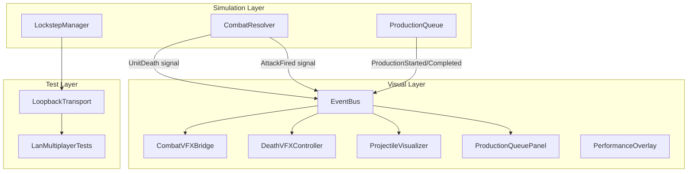
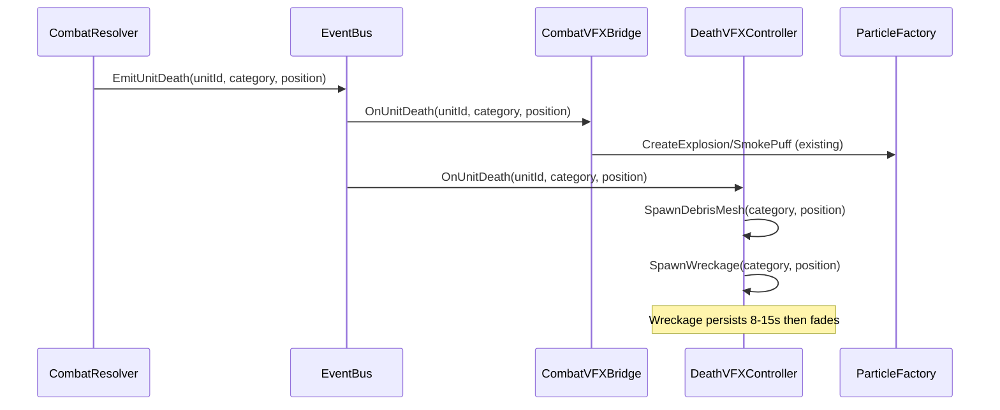
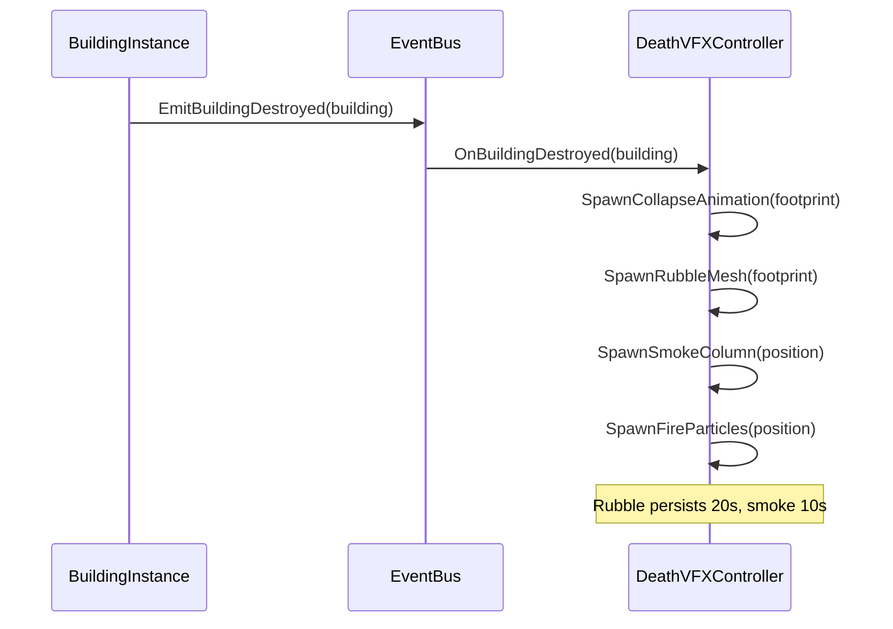
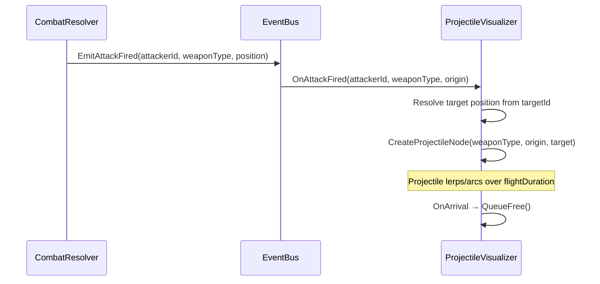
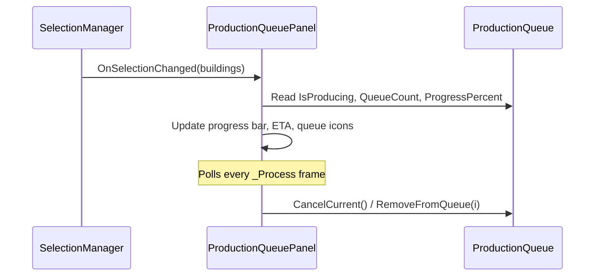
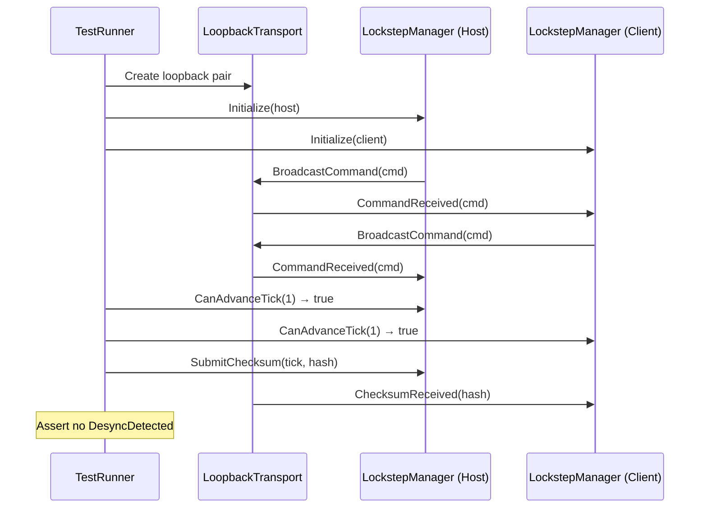

# Design Document: Release Polish

## Overview

Release Polish is a collection of five visual, UI, diagnostic, and validation features that bring Cordite Wars: Six Fronts to shipping quality. The subsystems are:

1. **Unit Death/Destruction VFX** — Scaled particle effects, debris meshes, and persistent wreckage when units and buildings are destroyed.
2. **Projectile Visuals** — Cosmetic projectile nodes (tracers, missiles, arcing shells) that fly between attacker and target without affecting the deterministic simulation.
3. **Production Queue UI** — An enhanced HUD panel showing per-building production state: current item, queue depth, progress bar, ETA countdown, and cancel controls.
4. **Performance Profiling** — An F4-toggled overlay displaying FPS, frame time, draw calls, terrain triangles, active units, pathfinding budget, and memory. Plus a one-time terrain benchmark logger.
5. **LAN Multiplayer Validation** — An integration test suite exercising the lockstep networking flow end-to-end using a loopback transport mock.

All five features share a critical constraint: **visual and diagnostic systems never mutate simulation state**. The deterministic lockstep model remains untouched.

## Architecture



## Sequence Diagrams

### Unit Death VFX Flow



### Building Destruction VFX Flow



### Projectile Visual Flow



### Production Queue UI Flow



### LAN Validation Test Flow



## Components and Interfaces

### Component 1: DeathVFXController

**Purpose**: Manages persistent death effects (debris, wreckage, rubble, smoke columns) that outlive the instant particle burst already handled by CombatVFXBridge.

```csharp
public partial class DeathVFXController : Node3D
{
    public void Initialize(Node3D worldRoot);

    // Signal handlers
    private void OnUnitDeath(int unitId, int unitCategory, Vector3 position);
    private void OnBuildingDestroyed(Node building);

    // Spawners
    private void SpawnUnitDebris(UnitCategory category, Vector3 position);
    private void SpawnUnitWreckage(UnitCategory category, Vector3 position);
    private void SpawnBuildingCollapse(BuildingInstance building);
    private void SpawnRubble(Vector3 position, int footprintWidth, int footprintHeight);
    private void SpawnSmokeColumn(Vector3 position, float duration);
    private void SpawnFire(Vector3 position, float duration);
}
```

**Responsibilities**:
- Subscribe to EventBus.UnitDeath and EventBus.BuildingDestroyed
- Scale VFX intensity by UnitCategory (Infantry=small puff, Vehicle=explosion+debris, Building=collapse+smoke column)
- Manage wreckage lifetime (auto-fade after configurable duration)
- Respect QualityManager.ParticleMultiplier for particle density
- Never affect simulation state

### Component 2: ProjectileVisualizer

**Purpose**: Spawns and animates cosmetic projectile nodes between attacker origin and target position.

```csharp
public partial class ProjectileVisualizer : Node3D
{
    public void Initialize(Node3D worldRoot);

    private void OnAttackFired(int attackerId, int weaponType, Vector3 origin);

    // Projectile creation by weapon class
    private Node3D CreateTracerProjectile(Vector3 origin, Vector3 target);
    private Node3D CreateMissileProjectile(Vector3 origin, Vector3 target);
    private Node3D CreateArcingShellProjectile(Vector3 origin, Vector3 target);
}
```

**Responsibilities**:
- Listen to EventBus.AttackFired
- Resolve target position from the target unit's current visual position
- Create appropriate projectile type based on WeaponType enum
- Animate projectile along path (linear lerp for tracers, bezier arc for shells, guided for missiles)
- Attach trail particles (smoke trail for missiles, none for bullets)
- Self-destruct on arrival
- Visual-only: no collision, no damage

### Component 3: ProductionQueuePanel

**Purpose**: Enhanced production queue HUD showing detailed build state for selected production buildings.

```csharp
public partial class ProductionQueuePanel : PanelContainer
{
    public void Initialize(SelectionManager selectionManager);

    // UI state
    public void TrackBuildings(List<BuildingInstance> buildings);
    public void ClearTracking();

    // Internal UI update
    private void UpdateProgressBar(ProductionQueue queue);
    private void UpdateETACountdown(ProductionQueue queue);
    private void UpdateQueueIcons(ProductionQueue queue);
    private void HandleCancelButton(ProductionQueue queue, int index);
}
```

**Responsibilities**:
- Integrate with existing GameHUD layout (replaces/enhances current ProductionQueueDisplay)
- Show current item name, progress bar, ETA countdown (seconds remaining)
- Show queue depth with icon buttons for each queued item
- Cancel button for current production and individual queue items
- Support multi-building selection (show first selected production building)
- Update every frame via _Process

### Component 4: PerformanceOverlay

**Purpose**: F4-toggled diagnostic overlay showing real-time performance metrics.

```csharp
public partial class PerformanceOverlay : CanvasLayer
{
    public void Initialize(GameSession session);
    public void Toggle();

    // Metric collection
    private float GetFPS();
    private float GetFrameTimeMs();
    private int GetDrawCalls();
    private int GetTerrainTriangleCount();
    private int GetActiveUnitCount();
    private float GetPathfindingBudgetUsage();
    private long GetMemoryUsageMB();
}
```

**Responsibilities**:
- Toggle visibility with F4 (separate from F3 debug overlay)
- Display: FPS, frame time (ms), draw calls, terrain triangles, active units, pathfinding budget %, memory (MB)
- Minimal performance impact (< 0.1ms overhead)
- Semi-transparent background for readability
- Update metrics with exponential moving average for stability

### Component 5: TerrainBenchmark

**Purpose**: One-time terrain generation benchmark that logs timing for each pipeline stage.

```csharp
public static class TerrainBenchmark
{
    public static BenchmarkResult RunBenchmark(MapData mapData, QualityTier tier);
}

public record BenchmarkResult(
    double ElevationBuildMs,
    double ErosionMs,
    double SubdivisionMs,
    double MeshGenerationMs,
    double MaterialMs,
    double DetailPassMs,
    double CliffGenerationMs,
    double LODSetupMs,
    double TotalMs,
    int TriangleCount,
    int VertexCount
);
```

**Responsibilities**:
- Time each TerrainEngine pipeline stage independently
- Log results to GD.Print and optionally to a file
- Run once on demand (not every frame)
- Report triangle/vertex counts for the generated mesh

### Component 6: LoopbackTransport

**Purpose**: In-memory mock transport for integration testing the lockstep protocol without real networking.

```csharp
public class LoopbackTransport
{
    public int LocalPeerId { get; }
    public bool IsHost { get; }
    public bool IsConnected { get; }

    // Events matching NetworkTransport interface
    public event Action<int, byte[]>? CommandReceived;
    public event Action<int, byte[]>? ChecksumReceived;
    public event Action<long>? PeerConnected;
    public event Action? ConnectedToHost;

    public void BroadcastCommand(byte[] data);
    public void BroadcastChecksum(byte[] data);
    public void SendCommand(int targetPeerId, byte[] data);
    public void SendChecksum(int targetPeerId, byte[] data);

    // Test control
    public static (LoopbackTransport host, LoopbackTransport client) CreatePair();
    public void SimulateConnect();
    public void SimulateDisconnect();
}
```

**Responsibilities**:
- Implement same event interface as NetworkTransport
- Route packets between paired instances synchronously (no actual network)
- Support simulating connection/disconnection for test scenarios
- Enable deterministic test execution (no timing dependencies)

## Data Models

### DeathVFXConfig

```csharp
public record DeathVFXConfig(
    float DebrisLifetime,       // seconds before debris fades (default 8)
    float WreckageLifetime,     // seconds before wreckage fades (default 15)
    float RubbleLifetime,       // seconds before rubble fades (default 20)
    float SmokeColumnDuration,  // seconds of smoke (default 10)
    float FireDuration          // seconds of fire (default 6)
);
```

**Validation Rules**:
- All durations must be > 0
- WreckageLifetime >= DebrisLifetime
- RubbleLifetime >= SmokeColumnDuration

### ProjectileConfig

```csharp
public record ProjectileConfig(
    ProjectileVisualType VisualType,
    float FlightSpeed,          // units per second
    float ArcHeight,            // peak height for arcing projectiles (0 for linear)
    bool HasTrail,              // whether to attach trail particles
    Color TrailColor,
    float ProjectileScale
);

public enum ProjectileVisualType
{
    Tracer,         // thin bright line, very fast
    Missile,        // mesh with smoke trail, moderate speed
    ArcingShell,    // parabolic arc, slow
    Beam            // instant line (laser weapons)
}
```

**Validation Rules**:
- FlightSpeed > 0
- ArcHeight >= 0
- ProjectileScale > 0

### WeaponType → ProjectileVisualType Mapping

```csharp
public static ProjectileVisualType GetVisualType(WeaponType weapon) => weapon switch
{
    WeaponType.MachineGun or WeaponType.Autocannon or WeaponType.AntiAir => ProjectileVisualType.Tracer,
    WeaponType.Missile or WeaponType.Rockets or WeaponType.SAM or WeaponType.Torpedo => ProjectileVisualType.Missile,
    WeaponType.Cannon or WeaponType.Artillery or WeaponType.Mortar or WeaponType.NavalGun => ProjectileVisualType.ArcingShell,
    WeaponType.Laser or WeaponType.RailGun => ProjectileVisualType.Beam,
    _ => ProjectileVisualType.Tracer
};
```

## Algorithmic Pseudocode

### Projectile Arc Interpolation

```csharp
/// <summary>
/// Computes the world position of an arcing projectile at time t ∈ [0, 1].
/// Uses a quadratic bezier with the control point elevated by arcHeight.
/// </summary>
ALGORITHM ComputeArcPosition(origin, target, arcHeight, t)
INPUT: origin: Vector3, target: Vector3, arcHeight: float, t: float ∈ [0,1]
OUTPUT: position: Vector3

BEGIN
    // Midpoint elevated by arc height
    midpoint ← (origin + target) / 2
    midpoint.Y ← midpoint.Y + arcHeight

    // Quadratic bezier: B(t) = (1-t)²·P0 + 2(1-t)t·P1 + t²·P2
    oneMinusT ← 1 - t
    position.X ← oneMinusT² × origin.X + 2 × oneMinusT × t × midpoint.X + t² × target.X
    position.Y ← oneMinusT² × origin.Y + 2 × oneMinusT × t × midpoint.Y + t² × target.Y
    position.Z ← oneMinusT² × origin.Z + 2 × oneMinusT × t × midpoint.Z + t² × target.Z

    RETURN position
END
```

**Preconditions:**
- `origin` and `target` are valid world positions
- `arcHeight >= 0`
- `t ∈ [0, 1]`

**Postconditions:**
- At t=0, returns origin
- At t=1, returns target
- At t=0.5, Y component is elevated by approximately arcHeight above the midpoint

### Death VFX Category Scaling

```csharp
ALGORITHM GetDeathVFXScale(category)
INPUT: category: UnitCategory
OUTPUT: (explosionType, debrisCount, wreckageDuration, smokeIntensity)

BEGIN
    MATCH category WITH
        Infantry, Special:
            RETURN (ExplosionSmall, 0, 0s, 0.0)

        LightVehicle, APC, Support:
            RETURN (ExplosionMedium, 3, 8s, 0.5)

        HeavyVehicle, Tank, Artillery:
            RETURN (ExplosionLarge, 6, 12s, 0.8)

        Helicopter, Jet:
            RETURN (ExplosionLarge, 4, 10s, 0.7)

        Building (small footprint ≤ 2×2):
            RETURN (ExplosionLarge, 8, 15s, 1.0)

        Building (large footprint > 2×2):
            RETURN (ExplosionLarge × 3 staggered, 12, 20s, 1.0)
    END MATCH
END
```

**Preconditions:**
- category is a valid UnitCategory enum value

**Postconditions:**
- Infantry always produces minimal VFX (small puff only)
- Vehicles produce debris meshes and persistent wreckage
- Buildings produce the most elaborate effects (collapse + rubble + smoke column)

### Lockstep Tick Advancement Gating

```csharp
ALGORITHM CanAdvanceToNextTick(lockstepManager, nextTick)
INPUT: lockstepManager: LockstepManager, nextTick: ulong
OUTPUT: canAdvance: bool

BEGIN
    FOR each player p IN [0, PlayerCount) DO
        IF confirmedTicks[p] does NOT contain nextTick THEN
            RETURN false
        END IF
    END FOR

    RETURN true
END
```

**Preconditions:**
- All players have been initialized in the lockstep manager
- nextTick > 0

**Postconditions:**
- Returns true if and only if every player has confirmed their command set for nextTick
- No side effects on lockstep state

**Loop Invariants:**
- All players checked so far have confirmed the tick

## Key Functions with Formal Specifications

### Function 1: DeathVFXController.OnUnitDeath()

```csharp
private void OnUnitDeath(int unitId, int unitCategory, Vector3 position)
```

**Preconditions:**
- `unitId` is a valid unit that existed in the simulation
- `unitCategory` is a valid UnitCategory enum cast to int
- `position` is a valid world-space coordinate
- DeathVFXController has been initialized with a world root

**Postconditions:**
- Spawns VFX nodes scaled to the unit category
- Infantry: small puff only (no debris, no wreckage)
- Vehicles: explosion + debris meshes + wreckage that persists for configured duration
- All spawned nodes are children of the world root
- No simulation state is modified

### Function 2: ProjectileVisualizer.CreateProjectileNode()

```csharp
private Node3D CreateProjectileNode(WeaponType weaponType, Vector3 origin, Vector3 target)
```

**Preconditions:**
- `weaponType` maps to a valid ProjectileVisualType
- `origin != target` (non-zero flight distance)
- ProjectileVisualizer has been initialized

**Postconditions:**
- Returns a Node3D positioned at `origin`
- Node has a Tween or _Process handler that moves it toward `target`
- On arrival, node calls QueueFree()
- If HasTrail, a GpuParticles3D child emits trail particles during flight
- Node has no collision shape (visual only)

### Function 3: PerformanceOverlay.CollectMetrics()

```csharp
private void CollectMetrics()
```

**Preconditions:**
- Overlay is visible (skip collection when hidden)
- GameSession reference is valid

**Postconditions:**
- All metric fields are updated with current frame data
- FPS and frame time use exponential moving average (smoothing factor 0.1)
- Draw calls read from RenderingServer.GetRenderingInfo()
- Memory read from OS.GetStaticMemoryUsage()
- Collection completes in < 0.1ms

### Function 4: LoopbackTransport.BroadcastCommand()

```csharp
public void BroadcastCommand(byte[] data)
```

**Preconditions:**
- Transport pair has been created via CreatePair()
- Both transports are in connected state
- `data` is non-null and non-empty

**Postconditions:**
- The paired transport's CommandReceived event fires synchronously
- Event args contain (senderPeerId, data) where senderPeerId is this transport's LocalPeerId
- Original data array is not mutated
- No actual network I/O occurs

## Example Usage

### Death VFX Integration

```csharp
// In GameSession setup, after CombatVFXBridge:
var deathVfx = new DeathVFXController();
deathVfx.Initialize(worldRoot);
AddChild(deathVfx);
// DeathVFXController auto-subscribes to EventBus.UnitDeath and BuildingDestroyed
```

### Projectile Visualizer Integration

```csharp
// In GameSession setup:
var projectileVis = new ProjectileVisualizer();
projectileVis.Initialize(worldRoot);
AddChild(projectileVis);
// Listens to EventBus.AttackFired, resolves target, spawns visual projectile
```

### Performance Overlay Toggle

```csharp
// In GameSession._UnhandledInput:
if (Input.IsActionJustPressed("toggle_perf_overlay")) // F4
{
    _performanceOverlay.Toggle();
}
```

### LAN Test with Loopback

```csharp
[Test]
public void CommandSynchronization_BothPeersReceiveCommands()
{
    var (hostTransport, clientTransport) = LoopbackTransport.CreatePair();

    var hostLockstep = new LockstepManager();
    hostLockstep.Initialize(0, 2, isHost: true, inputDelay: 6, hostTransport);

    var clientLockstep = new LockstepManager();
    clientLockstep.Initialize(1, 2, isHost: false, inputDelay: 6, clientTransport);

    // Host submits a move command
    var cmd = new MoveCommand { UnitIds = [1, 2], TargetPosition = new FixedVector2(10, 20) };
    hostLockstep.SubmitLocalCommand(cmd, currentTick: 0);

    // Client should have received it at tick 6 (inputDelay)
    var clientCmds = clientLockstep.GetCommandsForTick(6);
    Assert.That(clientCmds, Has.Count.EqualTo(1));
    Assert.That(clientCmds[0], Is.InstanceOf<MoveCommand>());
}
```

## Correctness Properties

1. **∀ unit death events: VFX intensity scales monotonically with unit category weight**
   - Infantry < LightVehicle < HeavyVehicle < Building

2. **∀ projectile visuals: projectile reaches target position within flightDuration ± 1 frame**
   - No projectile persists beyond its expected lifetime + 1 frame tolerance

3. **∀ production queue states: ETA countdown = (buildTime - currentProgress) / tickRate**
   - ETA is always non-negative and decreases monotonically while producing

4. **∀ lockstep ticks: CanAdvanceTick(t) = true ⟺ all players have confirmed tick t**
   - Tick never advances without unanimous confirmation

5. **∀ checksum exchanges: matching checksums ⟹ no DesyncDetected signal emitted**
   - Mismatched checksums always emit DesyncDetected exactly once per tick

6. **∀ visual projectiles: no collision layer set, no physics body, no simulation mutation**
   - Projectiles exist only in the rendering layer

7. **∀ performance overlay frames: metric collection overhead < 0.1ms**
   - Overlay does not measurably affect gameplay FPS

## Error Handling

### Error Scenario 1: Missing Target for Projectile

**Condition**: AttackFired event references a target unit that has already been freed from the scene tree (died same frame).
**Response**: ProjectileVisualizer falls back to the last known position of the target. If no position is available, projectile fires toward the event's origin position + forward vector and self-destructs after a short timeout.
**Recovery**: No crash, no orphaned nodes. Projectile always self-destructs.

### Error Scenario 2: Production Queue Building Destroyed Mid-Production

**Condition**: A building is destroyed while it has items in its production queue.
**Response**: ProductionQueuePanel detects the building node is freed (IsInstanceValid check) and clears its tracking. The simulation-side ProductionQueue handles refunds independently.
**Recovery**: Panel returns to hidden state. No dangling references.

### Error Scenario 3: Desync Detected During LAN Match

**Condition**: StateChecksum comparison reveals a mismatch between peers.
**Response**: LockstepManager emits DesyncDetected signal. The game displays a warning overlay to all players. Match continues (does not hard-stop) to allow players to save/screenshot.
**Recovery**: Players can choose to resync (reload from last checkpoint) or abandon match.

### Error Scenario 4: Performance Overlay Metric Source Unavailable

**Condition**: A metric source (e.g., pathfinding budget tracker) is null because the system hasn't initialized yet.
**Response**: Display "—" for unavailable metrics instead of crashing.
**Recovery**: Metrics appear automatically once the source system initializes.

## Testing Strategy

### Unit Testing Approach

- **VFXDispatcher**: Already pure C# — test that GetUnitDeathEffects returns correct effect lists per category
- **CommandSerializer**: Round-trip serialize/deserialize for all command types
- **StateChecksum**: Verify FNV-1a produces expected hashes for known inputs
- **ProjectileConfig mapping**: Verify WeaponType → ProjectileVisualType mapping covers all enum values
- **DeathVFXConfig validation**: Verify constraint enforcement (durations > 0, ordering)

### Property-Based Testing Approach

**Property Test Library**: NUnit with FsCheck (C# property-based testing)

- **CommandSerializer round-trip**: ∀ GameCommand cmd: Deserialize(Serialize(cmd)) == cmd
- **Checksum determinism**: ∀ state s: ComputeChecksum(s) called twice yields identical result
- **Projectile arc interpolation**: ∀ origin, target, arcHeight, t: ComputeArcPosition(origin, target, arcHeight, 0) == origin ∧ ComputeArcPosition(origin, target, arcHeight, 1) == target
- **Lockstep gating**: ∀ playerCount, confirmedSubset: CanAdvanceTick returns true iff confirmedSubset.Count == playerCount

### Integration Testing Approach

- **LAN Multiplayer Validation Suite** (the 5th feature itself):
  - Lobby creation and peer connection via LoopbackTransport
  - Command broadcast and reception between 2-6 simulated peers
  - Tick advancement gating (blocked until all confirm)
  - Checksum exchange and desync detection on intentional mismatch
  - Graceful disconnect handling (peer drops mid-match)

## Performance Considerations

- **Particle budget**: DeathVFXController respects QualityManager.ParticleMultiplier. At Potato tier, debris count is halved and wreckage lifetime is shortened.
- **Projectile pooling**: For high-fire-rate weapons (machine guns), projectile nodes are pooled rather than instantiated per shot. Pool size: 64 tracers.
- **Wreckage cleanup**: A background timer sweeps expired wreckage nodes every 2 seconds rather than checking every frame.
- **Performance overlay**: Metrics are collected once per frame only when visible. Draw call and triangle counts use cached RenderingServer queries (no per-object iteration).
- **Terrain benchmark**: Runs on a background thread where possible (mesh generation is the bottleneck). Falls back to main thread if Godot API calls are required.

## Security Considerations

- **LAN test loopback**: LoopbackTransport is test-only code, never compiled into release builds (guarded by `#if DEBUG` or test assembly).
- **Performance overlay**: Disabled in release builds by default. Can be enabled via a launch flag for QA testing.
- **No network exposure**: All new features are client-local. No new network packets or protocol changes are introduced.

## Dependencies

| Dependency | Purpose | Existing? |
|---|---|---|
| EventBus | Signal routing for all combat/production events | ✅ Yes |
| ParticleFactory | GPU particle creation | ✅ Yes |
| QualityManager | Particle density scaling | ✅ Yes |
| CombatVFXBridge | Existing VFX dispatch (extended, not replaced) | ✅ Yes |
| ProductionQueue | Production state source | ✅ Yes |
| ProductionQueueDisplay | Existing UI (enhanced/replaced) | ✅ Yes |
| LockstepManager | Lockstep protocol under test | ✅ Yes |
| NetworkTransport | Transport interface (mocked by LoopbackTransport) | ✅ Yes |
| CommandSerializer | Command serialization for test validation | ✅ Yes |
| StateChecksum | Checksum computation for desync tests | ✅ Yes |
| NUnit + FsCheck | Test framework (add to test project) | ⬜ New |
| DebugOverlay (F3) | Existing debug overlay (F4 overlay is separate) | ✅ Yes |
